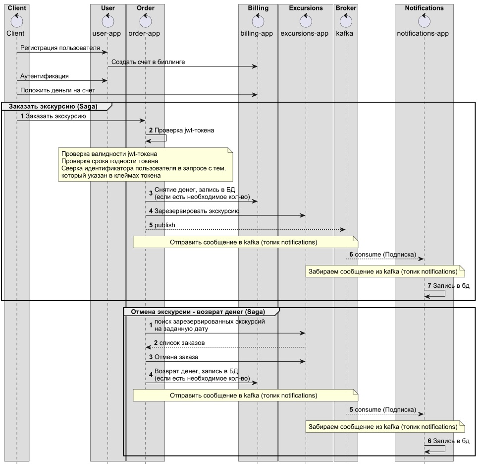

## hw0 - Патерны дикомпозиции сервисов

### Cистема бронирования экскурсий

1. Архитектура и схема взаимодействия
  

Сценарии:

1. Регистрация пользователя
2. Создание счета в биллинге
3. Вход пользователя в систему (аутентификация пользователя)
4. Пополненные счета (авторизация пользователя, проверка jwt-токена)
5. Заказать экскурсию (Saga основанная на оркестровке)
	- Авторизация пользователя, проверка jwt-токена
	- Списание цены билета со счета 
  	- Резервирование билетов 
	- Отправка нотификации пользователям (через брокер kafka) – отправка билетов на почту (эмулируется записью в БД)
6. Отмена экскурсии – возврат билетов (Saga основанная на оркестровке)
  	- Поиск заказов, которые были совершены на данную экскурсию в заданное время
  	– Возврат денег на счета клиентов 
  	- Отмена резервирования билетов 
  	- Отправка нотификации пользователям (через брокер kafka) – отправка отмены билетов на почту (эмулируется записью в БД)

Описание сервисов:

1. User-app -  сервис, который обеспечивает регистрацию и вход пользователей в систему
2. Billing-app – сервис, который обеспечивает управление счетами клиентов
3. Order-app – сервис, который обеспечивает управление заказами
4. Excursions-app – сервис, который управляет расписанием экскурсий и обеспечивает покупку/отмену экскурсий
5. Notifications-app – сервис, который эмулирует отправку почты (путем записи в БД)
6. Используется брокер сообщений Kafka

