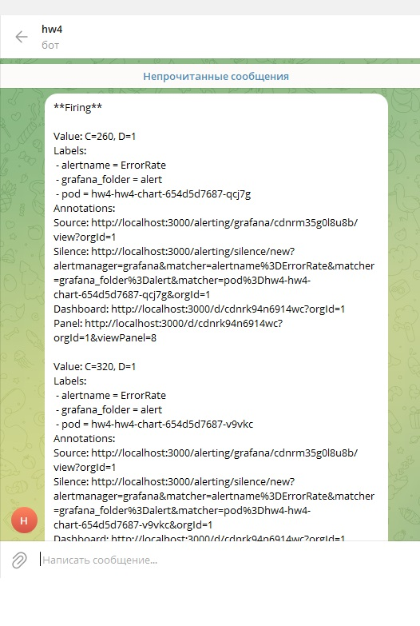

## hw4 - Prometheus. Grafana.
Инструментировать сервис из прошлого задания метриками в формате Prometheus 

0. Установка и настройка
```
[txt](actions.txt)
```

1. Метрики
```

```

2. json-дашборды.
```
[json](grafana-dashboard/hw4-dashboard.json)
```

3. Алерты в телеграм
```

```