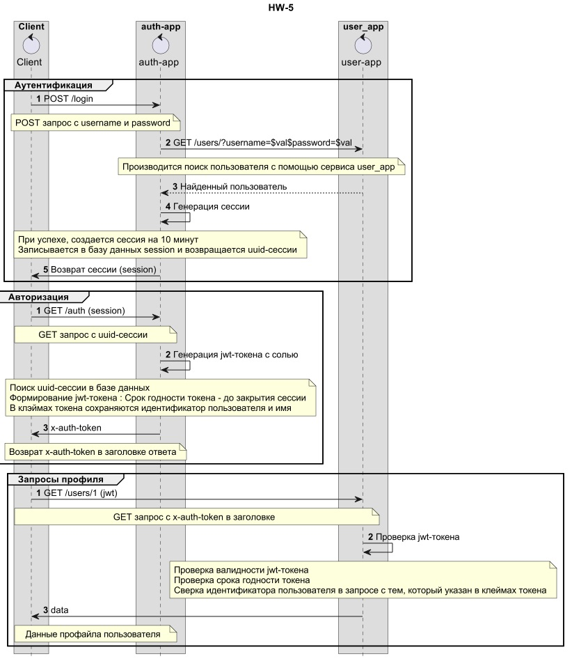
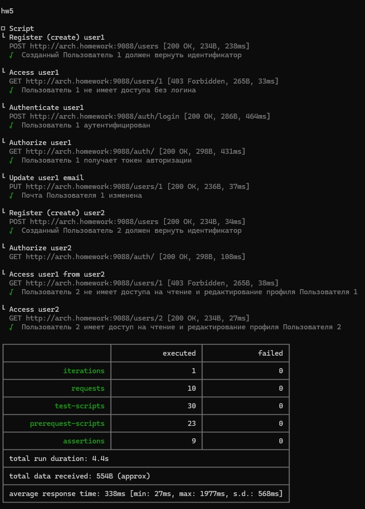

## hw5 - ApiGateway.
Добавление в приложение аутентификацию и регистрацию пользователей 

0. Установка и настройка
```
helm install hw5-auth hw5-auth-helm
helm install hw5-user hw5-user-helm
kubectl apply -f api-gateway/nginx-ingress/ingress.yaml
```

1. Архитектура и схема взаимодействия




2. Тест постмана (newman)


