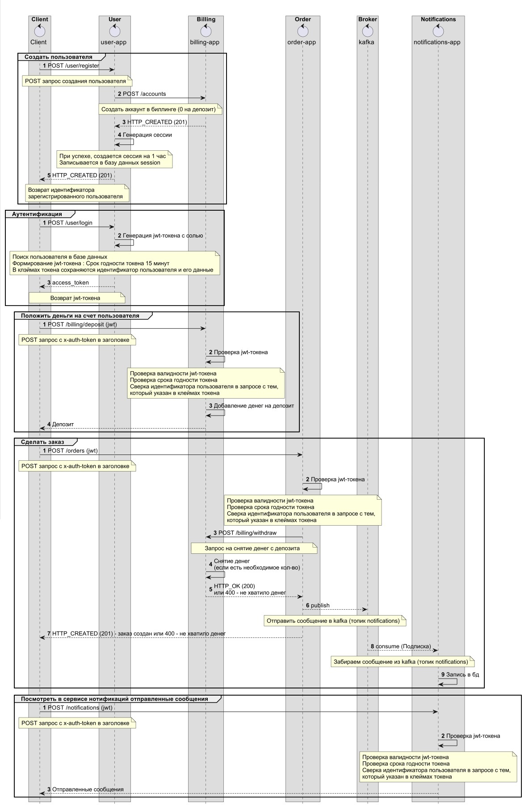
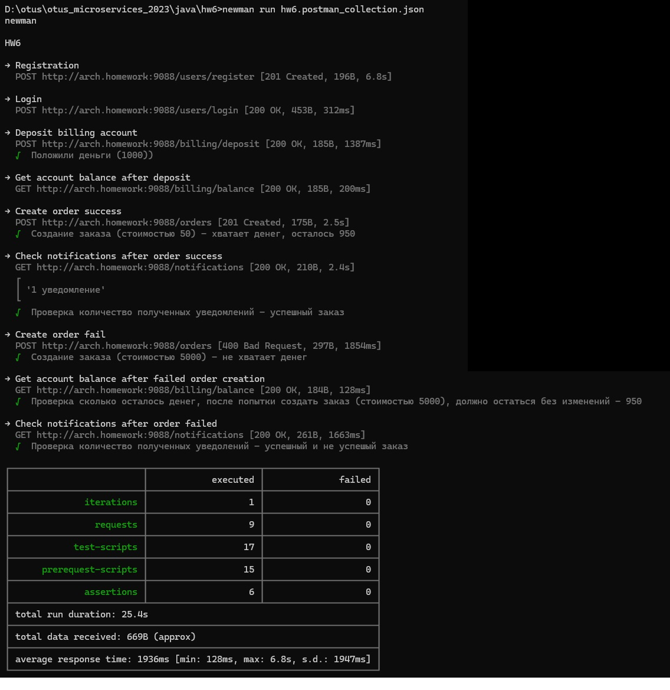

## hw6 - RESTful.
Сервис заказа. Сервис биллинга. Сервис нотификаций

0. Установка и настройка
```
Приложения:
helm install hw6-user helm/hw6-user-helm
helm install hw6-billing helm/hw6-billing-helm
helm install hw6-order helm/hw6-order-helm
helm install hw6-notifications helm/hw6-notifications-helm
Кафка:
helm install kafka helm/single-node-kafka
Ингресс:
kubectl apply -f api-gateway/nginx-ingress/ingress.yaml
```

1. Архитектура и схема взаимодействия




2. Тест постмана (newman)


