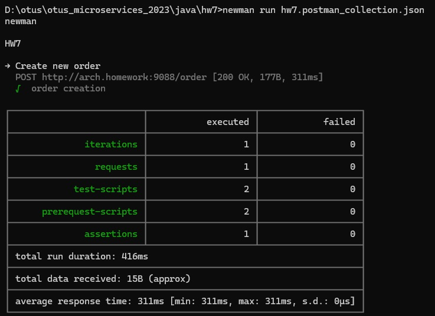
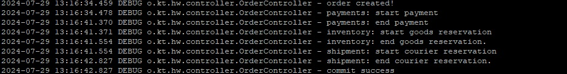

## hw7 - Распределенные транзакции
Реализовать сервисы "Платеж", "Склад", "Доставка".

0. Установка и настройка
```
Приложения:
helm install hw7-order hw7-order-helm
helm install hw7-payments hw7-payments-helm
helm install hw7-inventory hw7-inventory-helm
helm install hw7-shipment hw7-shipment-helm
Jaeger:
helm repo add jaeger-all-in-one https://raw.githubusercontent.com/hansehe/jaeger-all-in-one/master/helm/charts
helm install jaeger jaeger-all-in-one/jaeger-all-in-one
Ингресс:
kubectl apply -f api-gateway/nginx-ingress/ingress.yaml
```

1. Архитектура и схема взаимодействия
Сага, основанная на оркестровке (Orchestration) 


2. Тест постмана (newman)




3. Пример успешного выполнение Саги




4. Пример отката бизнес-транзакции (при неуспехе выделить курьера - откат всех остальных изменений)


6. Примеры отображения трассировки транзакции (и спаны) в системе Jaeger


