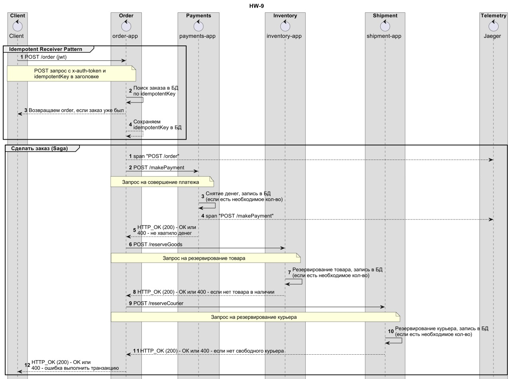
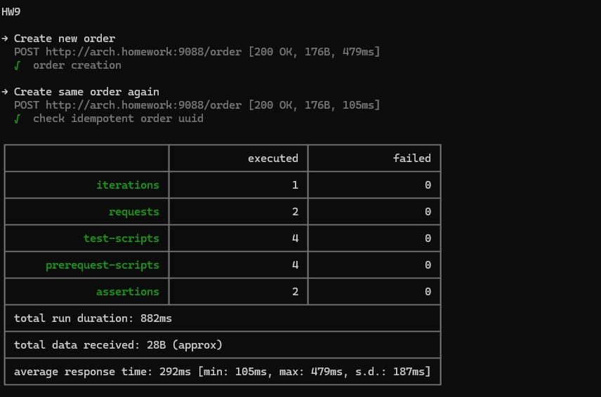

## hw9 - Идемпотентность
Сделать идемпотентным методы сервиса "Заказ" из предыдущего задания 
[ссылка](https://github.com/korolevt/otus_microservices_2023/blob/main/hw7/README.md)

0. Установка и настройка
```
Приложения:
(new) => helm install hw9-order hw9-order-helm
helm install hw7-payments hw7-payments-helm
helm install hw7-inventory hw7-inventory-helm
helm install hw7-shipment hw7-shipment-helm
Jaeger:
helm repo add jaeger-all-in-one https://raw.githubusercontent.com/hansehe/jaeger-all-in-one/master/helm/charts
helm install jaeger jaeger-all-in-one/jaeger-all-in-one
Ингресс:
kubectl apply -f api-gateway/nginx-ingress/ingress.yaml
```

1. Архитектура и схема взаимодействия
   
При реализациии был выбран Idempotent Receiver Pattern
(https://martinfowler.com/articles/patterns-of-distributed-systems/idempotent-receiver.html)





2. Тест постмана (newman)

Отправка повтороного заказа с тем же значением idempotentKey




