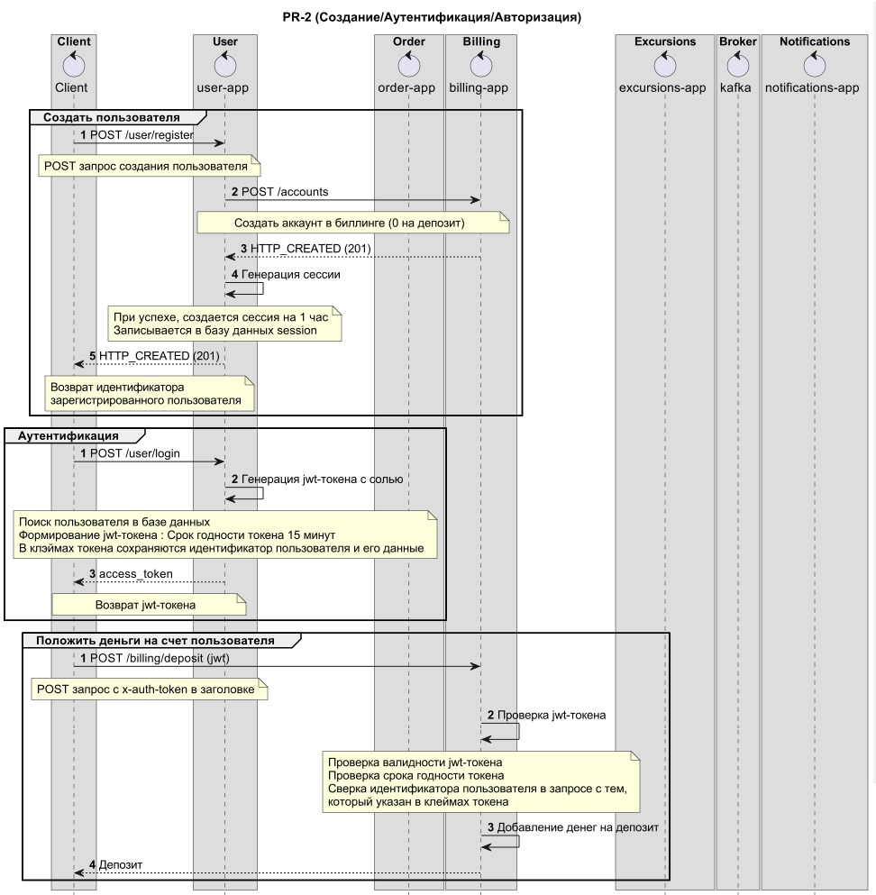
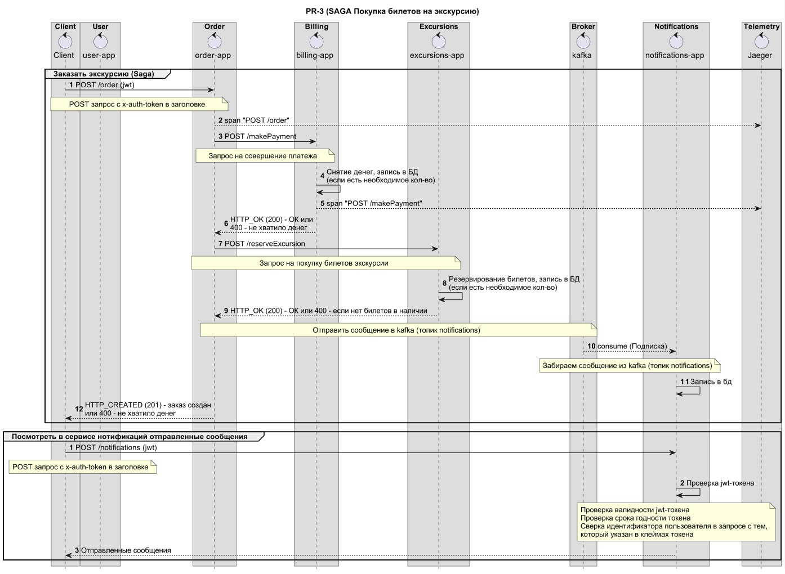
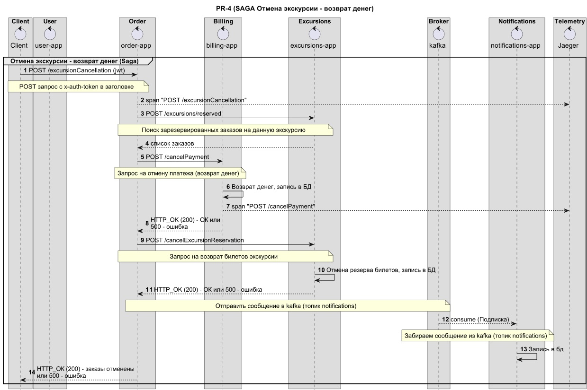
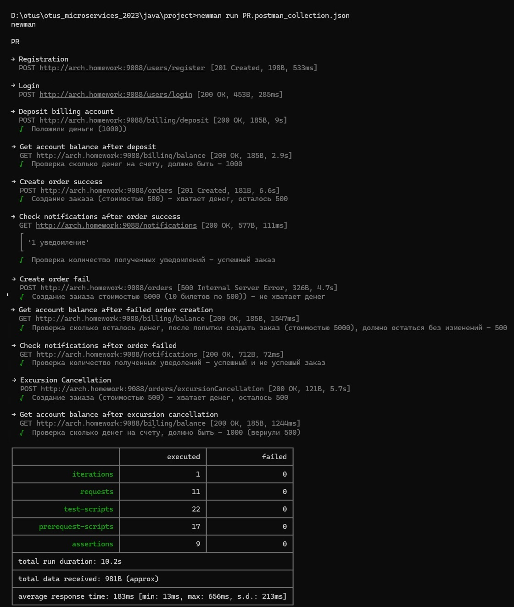

## Куросовая работа
###  Разработка системы бронирования экскурсий с использованием микросервисной архитектуры


1. Обшая архитектура и схема взаимодействия
  


Сценарии:

1. Регистрация пользователя
2. Создание счета в биллинге
3. Вход пользователя в систему (аутентификация пользователя)
4. Пополненные счета (авторизация пользователя, проверка jwt-токена)
5. Заказать экскурсию (Saga основанная на оркестровке)
	- Авторизация пользователя, проверка jwt-токена
	- Списание цены билета со счета 
  	- Резервирование билетов 
	- Отправка нотификации пользователям (через брокер kafka) – отправка билетов на почту (эмулируется записью в БД)
6. Отмена экскурсии – возврат билетов (Saga основанная на оркестровке)
  	- Поиск заказов, которые были совершены на данную экскурсию в заданное время
  	– Возврат денег на счета клиентов 
  	- Отмена резервирования билетов 
  	- Отправка нотификации пользователям (через брокер kafka) – отправка отмены билетов на почту (эмулируется записью в БД)

Описание сервисов:

1. User-app -  сервис, который обеспечивает регистрацию и вход пользователей в систему
2. Billing-app – сервис, который обеспечивает управление счетами клиентов
3. Order-app – сервис, который обеспечивает управление заказами
4. Excursions-app – сервис, который управляет расписанием экскурсий и обеспечивает покупку/отмену экскурсий
5. Notifications-app – сервис, который эмулирует отправку почты (путем записи в БД)
6. Используется брокер сообщений Kafka
7. Используется система Jaeger для трассировки транзакций


Идемпотентность обеспечена патерном Idempotent Receiver Pattern
(https://martinfowler.com/articles/patterns-of-distributed-systems/idempotent-receiver.html)

При отправке повтороного заказа с тем же значением idempotentKey, возвращается идентификатор уже сделанного заказа

2. Схема Регистрации/Аутентификаии/Авторизации клиента


3. Схема Покупки/Бронирования билетов на экскурсию (Сага основанная на оркестровке (Orchestration))


4. Схема Отмены экскурсии - возврат билетов и денег (Сага основанная на оркестровке (Orchestration))



5. Установка и настройка
```
Приложения:
helm install pr-user pr-user-helm
helm install pr-billing pr-billing-helm
helm install pr-order pr-order-helm
helm install pr-excursions pr-excursions-helm
helm install pr-notifications pr-notifications-helm
Кафка:
helm install kafka helm/single-node-kafka
Jaeger:
helm repo add jaeger-all-in-one https://raw.githubusercontent.com/hansehe/jaeger-all-in-one/master/helm/charts
helm install jaeger jaeger-all-in-one/jaeger-all-in-one
Ингресс:
kubectl apply -f api-gateway/nginx-ingress/ingress.yaml
```
[Prometheus. Grafana](actions.txt)


6. Тест постмана (newman)




7. Примеры отображения трассировки транзакции (и спаны) в системе Jaeger


